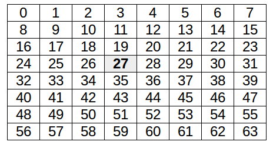
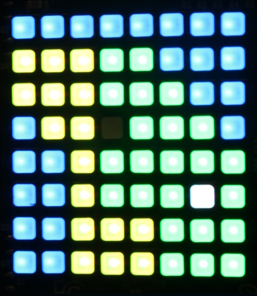

## Create the map

Now all that's left to do is create the map. You've already learned how to look up a colour from a block ID and set colours to display on the Sense HAT so this should be easy!

- Add in some block variables:

    ```python
    # blocks
    air = 0
    grass = 2
    water = 9
    sand = 12
    ```

- Add some colours:

    ```python
    # colours
    white = (255, 255, 255)
    green = (0, 255, 0)
    blue = (0, 0, 255)
    yellow = (255, 255, 0)
    black = (0, 0, 0)
    ```

- Create a dictionary mapping block IDs to colours:

    ```python
    # block: colour
    colours = {
        air: white,
        grass: green,
        water: blue,
        sand: yellow,
    }
    ```

- Modify your `while` loop like so:

    ```python
    while True:
        blocks = get_blocks()
        pixels = map_blocks_to_colours(blocks)
        print(pixels)
    ```

    Here we get the blocks from the `get_blocks` function which looks them up in the cached `known_blocks` dictionary or uses `mc.getBlock` to find them out. Then we try to convert these block IDs into colours, but that's currently a missing piece!

- Now you'll need a `map_blocks_to_colours` function which takes a list of block IDs and returns a list of corresponding colours. Add this after your `get_blocks` function:

    ```python
    def map_blocks_to_colours(blocks):
        return [lookup_colour(block) for block in blocks]
    ```

    **How does it work?**

    This function is a one-liner, but it's quite complex. It uses a concept called list comprehension, which is a way of building up a list in a loop in a concise way.

    The whole thing is wrapped in square brackets, representing a list, and the definition is to call the `lookup_colour` function for each block in `blocks`. The list builds up as it loops over the list of blocks passed in, and is returned as a list of 64 colours.

    However, we don't have a `lookup_colour` function yet either!

- Next you'll need to create a new `lookup_colour` function that takes a block and returns a colour. You could just use `colours[block]` but that will fail if you try to look up a colour which you haven't yet set in your directory.

    Here's a function that will return white if the block does not have a colour set:

    ```python
    def lookup_colour(block):
        if block in colours:
            return colours[block]
        else:
            return white
    ```

- Now you have a 64 item `pixels` list, print it out to see what it looks like. It should contain 64 3-tuples representing different colour values.

- You'll also need to define the variable `player_pos`. It'll need to be the number between `0` and `63` - the pixel which is the defined centre point of the grid. Since we used the range `x-3` to `x+5` and `z-3` to `z+5` the centre point will be the `(3, 3)` coordinate on the LED matrix, which is pixel number `27` as shown:

    

    Add the line `player_pos = 27` before your `while` loop.

- Now add a line to your `while` loop to modify the `pixels` list to set a black pixel where your player is standing:

    ```python
    pixels[player_pos] = black
    ```

- Everything's set up now and the last thing to do is send the list of pixels to the Sense HAT. Swap out the `print` line for a `set_pixels` one:

    ```python
    sense.set_pixels(pixels)
    ```

    Your `while` should now look like this:

    ```python
    while True:
        blocks = get_blocks()
        pixels = map_blocks_to_colours(blocks)
        pixels[player_pos] = black
        sense.set_pixels(pixels)
    ```

    This should now show a map of a small part of the Minecraft world around you. Walk around and watch it update!

    

**Download a copy of [minecraft_map.py](resources/minecraft_map.py)**

