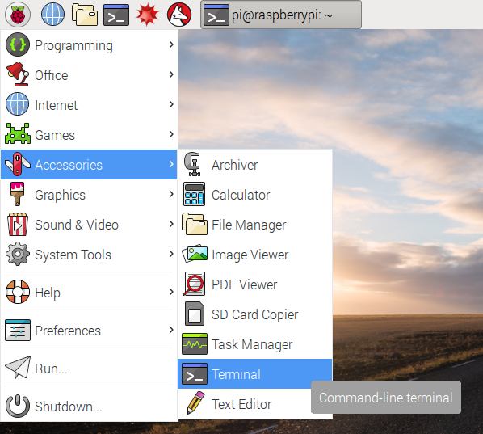

## Getting started with the Sense HAT's LED display

The Sense HAT has an 8x8 LED matrix. That's 64 full-colour LEDs which you can set to any colour using the Sense HAT Python module, to learn about how colour displays in electronic systems work.

- The first thing to do, is to attach your Sense Hat to your Raspberry Pi.

[[[rpi-sensehat-attach]]]

- Open the Terminal app from the applications menu, under **Accessories**, or from the taskbar or by pressing `CTRL`+`ALT`+`T`.

    

- Create a new directory for your project by entering the following command:

    ```bash
    mkdir minecraft-map
    ```

    `mkdir` means "make directory"; "directory" is another word for a folder.

- Open Python 3 from the applications menu, under **Programming**.

[[[rpi-gui-idle-opening]]]

- Save the file as `minecraft-map.py` in your new `minecraft-map` folder.

- Now begin by clearing the LED matrix in a solid red colour

[[[rpi-python-sensehat-clear]]]

You can choose a different colour to play around with.

[[[generic-theory-colours]]

- Try setting the matrix to be:
  - Green
  - Blue
  - Yellow
  
--- hints --- --- hint ---
Green would have colour values of `0, 255, 0`
--- /hint --- --- hint ---
You can create a new variable for each of the colours you want to use:
```python
green = (0, 255, 0)
```
--- /hint --- --- hint ---
Then you can use the variable to clear the matrix.
```python
from sense_hat import SenseHat
sense = SenseHat()

green = (0, 255, 0)
blue = (0, 255, 0)
yellow = (255, 255, 0)

sense.clear(yellow)
```
--- /hint --- --- /hints ---
