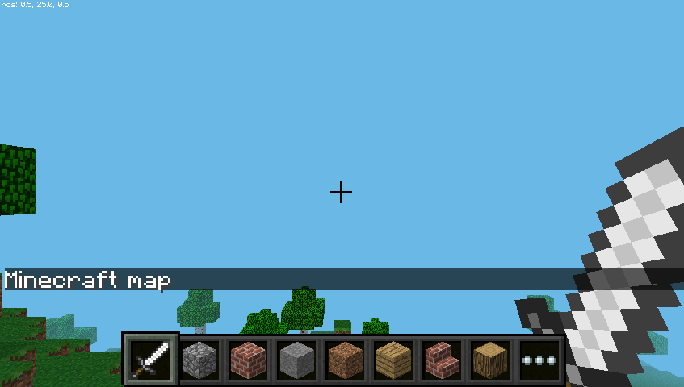

## What am I standing on?

Now you've had a go at setting the colours of the Sense HAT LED matrix, let's open up Minecraft and have a look around to see what block types you can identify.

+ Open Minecraft from the application menu, under **Games**:

    

+ Click **Start Game** and then either create a new world or enter an existing world.

+ Press the `Tab` key to regain access to the mouse cursor and then move the Minecraft window to one side of your screen.

+ Return to the Python window.

+ Move this window so that it is on the other side of the screen, and you can see the Python window and the Minecraft window side by side.

+ Now import the minecraft library, create a connection to the Minecraft API and put the message "Minecraft map" on the screen



--- hints ---

--- hint ---

The `Minecraft` class from the `mcpi.minecraft` library has `create()` and `postToChat(message)` functions.

--- /hint ---

--- hint ---

+ `from` the `mcpi.minecraft` library import `Minecraft`
+ Use `Minecraft` to `create()` a connection object
+ The connection object's `postToChat("mymessage")` function will put a message in Minecraft

--- /hint ---

--- hint ---

<video width="1024" height="768" controls>
<source src="images/minecraft_create_connection.webm" type="video/webm">
Your browser does not support WebM video, so try FireFox or Chrome.
</video>

--- /hint ---

--- hint ---

Use the following code:
```python
from mcpi.minecraft import Minecraft
mc = Minecraft.create()
mc.postToChat("Minecraft map")
```

--- /hint ---

--- /hints ---

Let's look at how you can determine what type of block you're standing on.

[[[rpi-python-minecraft-getblock]]]

- You can now use an infinite loop to constantly find out what block your Minecraft player is standing on, and print it out in the shell.

[[[generic-python-while-true]]]

--- hints --- --- hint ---
It is the last three lines of your script that need to be placed in an infinite loop.

```python
x, y, z = mc.player.getTilePos()
block_id = mc.getBlock(x, y-1, z)
print(block_id)
```
--- /hint --- --- hint ---
You can use `while True:` to create an infinite loop.
--- /hint --- --- hint ---
- Your code should look something like this:

```python
from sense_hat import SenseHat
import mcpi.minecraft as minecraft

sense = SenseHat()
mc = minecraft.Minecraft.create()

red = (255, 0, 0)
sense.clear(red)

while True:
    x, y, z = mc.player.getTilePos()
    block_id = mc.getBlock(x, y-1, z)
    print(block_id)
```
--- /hint --- --- /hints ---
