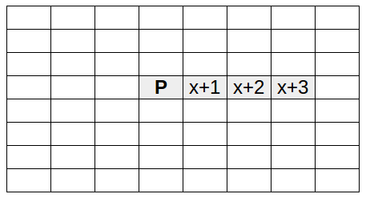
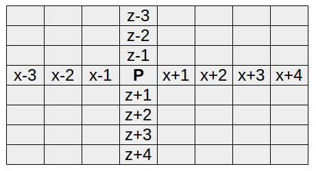

## Create a mini map

Now you have the Sense HAT showing the colour of the block you're standing on, you can use the same logic to show a different colour for each block around you to make a mini map of the Minecraft world on the LED display.

In order to make an 8x8 map, you'll need to retrieve the block IDs for all blocks immediately surrounding your player - enough to fill the 8x8 display. The Minecraft API does have an `mc.getBlocks()` function, but unfortunately it doesn't actually work, so you'll have to write your own function.

+ Open up the `minecraft-map.py` file you were working on earlier.

You will be making a lot of changes this program, so you may want to create a copy using **file**, **save as** and creating a new file.

+ Delete your `while True:` loop, and in it's place define a function called `get_blocks()`

[[[generic-python-simple-functions]]]

The function will eventually look up the block the player is standing on and find the block IDs of enough of the surrounding blocks to fill the LED matrix.

Let's start simple and look up the player's position and the 3 blocks to the right of the player, to return a list of four block IDs:



+ Inside your function, create an empty list called `blocks`. This is where we will store the blocks we find.

[[[generic-python-create-list]]]

+ Add a line of code to find the player's `x`, `y`, `z` coordinates, just like you did before.

+ Subtract one from the `y` coordinate. This is so that we are looking at the layer of blocks _beneath_ the player.

+ Still inside the function, add a `for` loop which runs in the range `x` to `x + 5`. This means that the first block looked at will be the one immediately underneath the player, and the loop will stop looking at blocks when it gets to the block `4` spaces away from the player.

--- collapse ---

---
title: Why `x + 5` and not `x + 4`?
---

The following code will loop 5 times: 

```python
for i in range(0, 5):
```

It does this by using `range` to create a list of elements starting at `0` up to, but **not including**, `5` i.e. `[0,1,2,3,4]`.

In our Minecraft map example we want all the positions from our starting point `x` up to and **including** the block `4` spaces away, but as `range` doesn't include the last element we use `x + 5`.

--- /collapse ---

```python
for dx in range(x, x + 5):
```

+ Inside the loop, find the block ID of the block at the position `dx`, and `append` it to the blocks list.

+ Finally, after your `for` loop, return the data from the `blocks` list

--- hints --- --- hint ---
You should begin with your code, without the `while True:` but containing the function definition.
```python
from sense_hat import SenseHat
import mcpi.minecraft as minecraft
from time import sleep

sense = SenseHat()
mc = minecraft.Minecraft.create()

grass = 2
water = 9
sand = 12

green = (0, 255, 0)
blue = (0, 0, 255)
yellow = (255, 255, 0)

colours = {
    grass: green,
    water: blue,
    sand: yellow,
    }

def get_blocks():
```
--- /hint --- --- hint ---
The initial setup of the function creates a list and gets the `x`, `y`, and `z` coordinates.
```python
def get_blocks():
    blocks = []
    x, y, z = mc.player.getTilePos()
    y -= 1
```
--- /hint --- --- hint ---
The `for` loop should iterate over the blocks from `x` to `x+4`, add the block id to the list and then return the `blocks` list.
```python
def get_blocks():
    blocks = []
    x, y, z = mc.player.getTilePos()
    y -= 1
	    for dx in range(x, x + 5):
        block = mc.getBlock(dx, y, z)
        blocks.append(block)
    return blocks
```
--- /hint --- --- /hints ---

- Add a line to the end of your code to print out the result of the `get_blocks` function:

    ```python
    print(get_blocks())
    ```

- Run the code and you should see a list of four numbers (block IDs), which will be the block you are standing on and the three blocks to the side of you (the direction depends on which way you're facing).

- Now you'll want to alter your code so that it looks at all the blocks to the left and right of the player as well. The blocks will be from `x-3` up to `x+5`

- How about the blocks in front of and behind the player? These are on the `z` axis. You could do this by adding another `for` loop that loops over `z-3` up to `z+5`. The loop iterating over the `x` values can be nested within it.



--- hints --- --- hint ---
Start by increasing the range over which the loop looks at the `x` axis.
```python
def get_blocks():
    blocks = []
    x, y, z = mc.player.getTilePos()
    y -= 1
    for dx in range(x - 3, x + 5):
        block = mc.getBlock(dx, y, z)
        blocks.append(block)
    return blocks
```
--- /hint --- --- hint ---
Now add in the loop over the `z` axis, and nest the other loop within it.
```python
def get_blocks():
    blocks = []
    x, y, z = mc.player.getTilePos()
    y -= 1
    for dz in range(z - 3, z + 5):
        for dx in range(x - 3, x + 5):
            block = mc.getBlock(dx, y, d)
            blocks.append(block)
    return blocks
```
--- /hint --- --- hint ---
Lastly, make sure that the `getBlock` method is looking at `dz`.
```python
def get_blocks():
    blocks = []
    x, y, z = mc.player.getTilePos()
    y -= 1
    for dz in range(z - 3, z + 5):
        for dx in range(x - 3, x + 5):
            block = mc.getBlock(dx, y, dz)
            blocks.append(block)
    return blocks
```
--- /hint --- --- /hints ---

- To finish off this section add a `while` loop to print the result of `get_blocks` every second:

    ```python
    while True:
        print(get_blocks())
        sleep(1)
    ```

- Run the code and see it update as you walk around.

You will probably find that it's a bit laggy: it takes a small amount of time to retrieve each block ID, and you're trying to do 64 every second.
