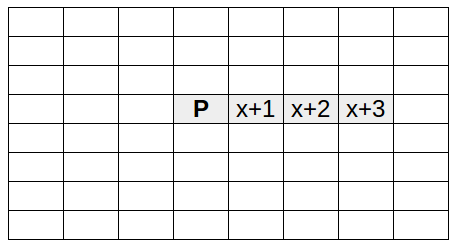

## Write a get_blocks function

Now you have your Sense HAT showing the colour of the block you're standing on, you can use the same logic to show a different colour for each block around you to make a mini map of the Minecraft world on the 8x8 display.

In order to make an 8x8 map, you'll need to retrieve the block IDs for all blocks immediately surrounding your player - enough to fill the 8x8 display. The Minecraft API does have an `mc.getBlocks()` function, but unfortunately it doesn't actually work, so you'll have to write your own function.

- Create a new Python file and save it as `minecraft-map.py`.

- Start by writing the following starter code:

    ```python
    from sense_hat import SenseHat
    from mcpi.minecraft import Minecraft
    from time import sleep

    sense = SenseHat()
    mc = Minecraft.create()

    def get_blocks():
        blocks = []

        return blocks
    ```

    Here you've imported the libraries you'll need, created a connection to the Sense HAT and to the Minecraft world, and created a function called `get_blocks` which returns an empty list.

- Now you'll need to implement your `get_blocks` function. It would be nice to have a generic `get_blocks` function for any given range of `x`, `y` and `z` returning a cuboid of block IDs but for our purposes this is unnecessary as all we need is an 8x8 grid on the same y-axis.

    Starting with a simple version, we want to look up the block the player is standing on, and the 3 blocks to the right of the player to return a list of four block IDs:

    

    Enter the following code into your function:

    ```python
    def get_blocks():
        blocks = []
        x, y, z = mc.player.getTilePos()
        y -= 1
        for dx in range(x, x+4):
            block = mc.getBlock(dx, y, z)
            blocks.append(block)
        return blocks
    ```

    **What does it do?**

    - `blocks = []`: creates a new empty list.
    - `x, y, z = mc.player.getTilePos()`: get the player's position.
    - `y -= 1`: subtract one from the `y` coordinate to look at the level below the player.
    - `for dx in range(x, x+4):`: use `x` values from the player to 3 blocks away from the player.
    - `block = mc.getBlock(dx, y, z)`: look up the block at this location.
    - `blocks.append(block)`: add this block to the list.
    - `return blocks`: by the time the program gets to this line, this contains 4 blocks as it's been through the loop 4 times.

- Add a line to the end of your code to print out the result of the `get_blocks` function:

    ```python
    print(get_blocks())
    ```

- Run the code and you should see a list of four numbers (block IDs), which will be the block you are standing on and the three blocks to the side of you (the direction depends on which way you're facing).

- Now you'll want to make the function do the same for a 2-dimensional space. This version loops over `x` and `z` 4 times and returns 16 values:

    ```python
    def get_blocks():
        blocks = []
        x, y, z = mc.player.getTilePos()
        y -= 1
        for dz in range(z, z+4):
            for dx in range(x, x+4):
                block = mc.getBlock(dx, y, dz)
                blocks.append(block)
        return blocks
    ```

    **What does it do?**

    - `blocks = []`: creates a new empty list.
    - `x, y, z = mc.player.getTilePos()`: get the player's position.
    - `y -= 1`: subtract one from the `y` coordinate to look at the level below the player.
    - `for dz in range(z, z+4):`: use `z` values from the player to 3 blocks away from the player (4 rows in total).
    - `for dx in range(x, x+4):`: use `x` values from the player to 3 blocks away from the player (4 columns in total).
    - `block = mc.getBlock(dx, y, dz)`: look up the block at this location.
    - `blocks.append(block)`: add this block to the list.
    - `return blocks`: by the time the program gets to this line, this contains 16 blocks as it's been through each loop 4 times.

- Run the code and you should see a list of 16 block IDs, starting with the block you're standing on and the 7 to the side of you, followed by each row of 8 blocks away from you.

- Now you'll want to make it loop over 8 rows and 8 columns, and make sure it looks to the left and right, and both behind and ahead of you. This version loops over `x` and `z` 8 times and returns 64 values:

    ```python
    def get_blocks():
        blocks = []
        x, y, z = mc.player.getTilePos()
        y -= 1
        for dz in range(z-3, z+5):
            for dx in range(x-3, x+5):
                block = mc.getBlock(dx, y, dz)
                blocks.append(block)
        return blocks
    ```

    **What does it do?**

    - `for dz in range(z-3, z+5):`: use `z` values from 3 behind the player up to 5 ahead (8 rows in total).
    - `for dx in range(x-3, x+5):`: use `x` values from 3 left of the player over to 5 to the right (8 columns in total).
    - `return blocks` - by the time the program gets to this line, this contains 64 blocks as it's been through each loop 8 times.

- Run the code and you should see a list of 64 block IDs. This time they should be the 8x8 grid of blocks surrounding your player, with you in the middle (there's no centre point of an 8x8 grid so you're just off-centre):

    

- Next, add a `while` loop to print the result of `get_blocks` every second:

    ```python
    while True:
        print(get_blocks())
        sleep(1)
    ```

- Run the code and see it update as you walk around.

    You will probably find that it's a bit laggy: it takes a small amount of time to retrieve each block ID, and you're trying to do 64 every second.

