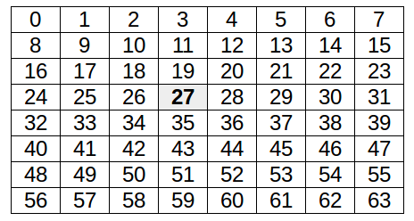

## Create the map

Now all that's left to do is create the map. At the moment, the data returned from the `get_blocks` function is a simple list of block ids. This needs to be changed so that it becomes a list of colour values.

- Create a new function above your `while True:` loop.

```python
def map_blocks_to_colours(blocks):
```

- You'll now want to structure this function to look up the block colours. Here's how you could go about doing it:
  1. Create a new list called pixels.
  1. Use a `for` loop to iterate over the `blocks` list
  1. **If** a `block` is in the `colours` dictionary, then look up it's colour and add it to the pixels list.
  1. **Else** add another colour to the `pixels` list. `white` would be a good choice. `(255, 255, 255)`.
  
--- hints --- --- hint ---
Start by creating the `pixels` list:
```python
def map_blocks_to_colours(blocks):
    pixels = []
```
--- /hint --- --- hint ---
Now use a `for` loop, to look up the block id and add the colour to the pixels list.
```python
def map_blocks_to_colours(blocks):
    pixels = []
    for block in blocks:
        if block in colours:
            pixels.append(colours[block])
```
--- /hint --- --- hint ---
If it's not there, just add `(255, 255, 255)`. Then return the list of `pixels`
```python
def map_blocks_to_colours(blocks):
    pixels = []
    for block in blocks:
        if block in colours:
            pixels.append(colours[block])
        else:
            pixels.append((255, 255, 255))
    return pixels
```
--- /hint --- --- /hints ---

- To finish off you'll need to use your new function in your `while True:` loop. Alter it so that it gets the `pixels` and then sets the Sense Hat display with these pixels. You may also want to indicate the player's position. The player's coordinates are at position `27` in the `pixels` list.



```python
while True:
    blocks = get_blocks()
    pixels = map_blocks_to_colours(blocks)
    pixels[27] = [0,0,0]
    sense.set_pixels(pixels)
```

- Save and run your code, then move slowly around your Minecraft world as you begin to build up a map.


