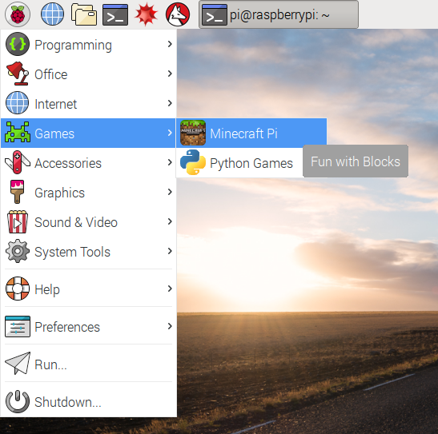
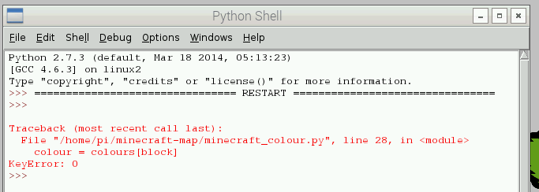

# Make a Minecraft Map with the Sense HAT

Use the Sense HAT to create a map of the world around your player in Minecraft: Pi Edition.

## Getting started with the Sense HAT's LED display

The Sense HAT has an 8x8 LED matrix. That's 64 full-colour LEDs (light-emitting diodes) you can set to any colour using the Sense HAT Python module, and learn about how colours work.

1. Mount the Sense HAT on your Raspberry Pi and boot up the Pi.

    

1. Open the Terminal app from the applications menu, under *Accessories*, or from the taskbar:

    

1. Create a new directory for your project by entering the following command:

    ```bash
    mkdir minecraft-map
    ```

    *`mkdir` means "make directory" - which is another word for a folder*

1. Open Python 3 from the applications menu, under *Programming*:

    

1. When the Python shell window opens up, click `File > New File` to open a new window. This is where you'll enter your code.

1. Save the file as `colours.py` in your new `minecraft-map` folder.

1. Enter the following code:

    ```python
    from sense_hat import SenseHat

    sense = SenseHat()

    sense.clear(255, 0, 0)
    ```

1. Save with `Ctrl + S` and run with `F5`.

    Your Sense HAT LEDs should now be all red!

    **How does it work?**

    - `from sense_hat import SenseHat` - this lets you use the Sense HAT module
    - `sense = SenseHat()` - this creates a connection to the Sense HAT hardware, called `sense`
    - `sense.clear(255, 0, 0)` - here we call the `clear` method (function) on the `sense` object and pass in three colour values - for red, green and blue

    **How do colours work?**

    - All colours are made up of a red value, a green value and a blue value - like mixing colour paints to make a different colour
    - Colour values go from `0` (none) to `255` (full)
    - Here we used `(255, 0, 0)` - which is full red, no green and no blue
    - Similarly, `(0, 255, 0)` is full green and `(0, 0, 255)` is full blue
    - Purple is a mix of blue and red, so `(255, 0, 255)` is purple

1. Try changing the colour to:

    - green `(0, 255, 0)`
    - blue `(0, 0, 255)`

1. More things to try (think before you try them)

    - What colour does `(255, 255, 0)` make?
    - If `(255, 0, 255)` makes purple, what would `(100, 0, 255)` and `(255, 0, 100)` look like?
    - What colour does full red, green and blue `(255, 255, 255)` make?
    - What colour does `(0, 0, 0)` make?
    - What happens if you call `sense.clear()` without any colour values?

    *Inside each of the Sense HAT's 64 LEDs are three smaller LEDs - a red, a green and a blue. All you're doing is setting the brightness of each one and it gives the whole LED a different colour*

## Exploring the Minecraft world

Now you've had a go at setting the colours of the Sense HAT LED matrix, let's open up Minecraft, have a look around and see what block types you can identify.

1. Open Minecraft from the application menu, under *Games*:

    

1. Click **Start Game** and then either create a new world or enter an existing world.

1. Press the `Tab` key to regain access to the mouse cursor and then move the Minecraft window to one side of your screen.

1. Return to the Python windows. Open another new window from the Python shell and save it as `minecraft-colours.py` in the same project folder.

1. Move this window so it's on the other side of the screen so you can see the Python window and the Minecraft window side-by-side.

1. Enter the following code to get started:

    ```python
    from mcpi.minecraft import Minecraft
    from sense_hat import SenseHat
    from time import sleep

    mc = Minecraft.create()
    sense = SenseHat()

    mc.postToChat("Hello Minecraft!")
    sense.clear(0, 255, 0)
    ```

1. Save and run your code!

    You should see the text "Hello Minecraft" appear in the Minecraft window and the Sense HAT should turn green!

1. Now you've created a connection to both the Sense HAT and the Minecraft world, let's look at how you can determine what type of block you're standing on. Remove the `postToChat` and `sense.clear` lines and add the following code:

    ```python
    while True:
        x, y, z = mc.player.getTilePos()
        block = mc.getBlock(x, y-1, z)
        print(block)
        sleep(0.1)
    ```

1. Save and run the code.

    You should now see numbers being constantly printed to the Python shell. These numbers represent the IDs of the block your player is standing on. Walk around over different terrain and you'll see the number change.

    *Note: use the WASD keys to walk around, and space to jump or fly*

    **How does it work?**

    - `while True` - this is an infinite loop
    - `x, y, z = mc.player.getTilePos()` - this gets the coordinates of where your player is standing and sets them to variables `x`, `y` and `z`
    - `block = mc.getBlock(x, y-1, z)` - this looks up the ID of the block directly beneath the player (`y-1` means one below the player's `y` coordinate, which is the vertical axis)
    - `print(block)` - this shows us which block ID was returned by `getBlock`
    - `sleep(0.1)` - this pauses for a tenth of a second each time the loop runs, so it's not printing out too fast

1. You need to know the block types that are represented by the IDs you're seeing. Some common ones are:

    ```
    Air:   0
    Stone: 1
    Grass: 2
    Dirt:  3
    Water: 8
    Sand: 12
    Ice:  79
    ```

    See which ones you can identify while walking around the Minecraft world.

## Minecraft Sense HAT Colour Walk

Now you've explored the Minecraft world and seen the different block IDs that are printed out as you walk around, you're going to learn to make the Sense HAT show a different colour depending on what type of block you're standing on in the Minecraft world!

1. Next, you're going need a way creating a mapping from a block ID to a colour; for example grass should map to green, so block ID `2` should map to the colour code `(0, 255, 0)`.

    Start by adding some variables to identify block IDs. Add the following code above your `while` loop like so:

    ```python
    # blocks
    grass = 2
    water = 9
    sand = 12
    ```

    *The first line is a comment helping explain what that bit of code is for. These variables are all integers (whole numbers) because that's what block IDs are represented by.*

1. Below that, add the colours that represent these block types:

    ```python
    # colours
    green = (0, 255, 0)
    blue = (0, 0, 255)
    yellow = (255, 255, 0)
    ```

    *These variables are tuples - which is a data type (like integer, string and list) used to store a number of items in a particular order, like `x`, `y` and `z` coordinates or in this case, `R`, `G` and `B` values of a colour. These are 3-tuples because they each contain 3 values.*

1. Next, below the colours, create a dictionary mapping each of the block types to a particular colour:

    ```python
    # block: colour
    colours = {
        grass: green,
        water: blue,
        sand: yellow,
    }
    ```

    *A dictionary is a data type used for storing relations between two objects, like an address book mapping a name to a telephone number. The items in the dictionary are referred to as key-value pairs, so in an address book the name is the "key" and the phone number is the "value". In our case the block type is the "key" and the colour is the "value".*

1. Now all that's left to do is to look up the block you're standing on, see which colour it should be, and use `sense.clear` to change the colour of the Sense HAT display acdordingly!

    To look up a value in a dictionary, you pass in the key. If the dictionary was an address book, you'd pass in the name and be given that person's phone number. So to look up the block type `grass` you'd use `colours[2]` or `colours[grass]` and you'd get back the value for green which is `(0, 255, 0)`.

    Modify your `while` loop to look like this:

    ```python
    while True:
        x, y, z = mc.player.getTilePos()
        block = mc.getBlock(x, y-1, z)
        colour = colours[block]
        print(colour)
        sleep(0.1)
    ```

    *Here we're looking up the ID of the block the player is standing on, as before, and then looking that up in the `colours` dictionary, then printing out the colour code tuple.*

1. Save and run the code, and walk around the Minecraft world.

    You should see the colour code of the block you're standing on. Walk around to see different colour codes. When you walk on grass you should see `(0, 255, 0)`, when you're on sand you should see `(255, 255, 0)`, and on water, `(0, 0, 255)`.

1. If you walk over a block that's not in the dictionary you'll get an error. If you haven't found another block type yet, just jump in the air using the space bar, and you'll get this error:

    

    *This error is a `KeyError`, which is a Python exception meaning you tried to look up the value of a key that isn't in the dictionary, like trying to get the telephone number of a name you haven't got recorded.*

1. First of all, let's deal with the `KeyError`. Modify your colour lookup like so:

    ```python
    if block in colours:
        colour = colours[block]
        print(colour)
    else:
        print("Don't know block ID %s" % block)
    sleep(0.1)
    ```

    Now it will check to see if the key is in the dictionary before looking up its value. If it's not, it will tell you which block ID it was.

1. Finally, now you have a colour value representing the block type your player is standing on, you can tell the Sense HAT to show that colour on the LED display, simply by changing the `print(colour)` line to:

    ```python
    sense.clear(colour)
    ```

1. Save and run the code, and walk around the Minecraft world and your Sense HAT should show green, blue or yellow when you walk on grass, water and sand.

1. Now add more blocks and colours to your dictionary!

## Create a map

## What next?
